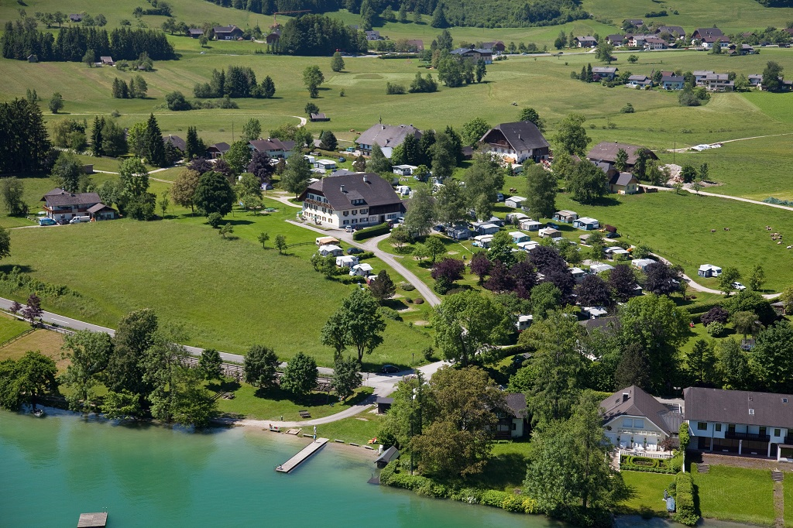
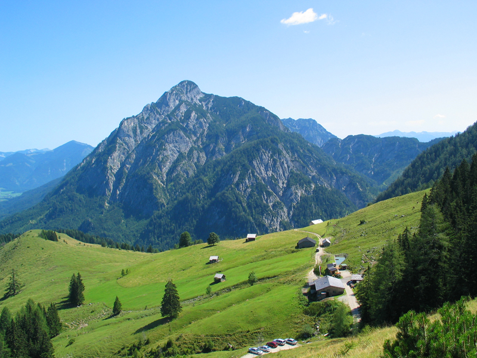
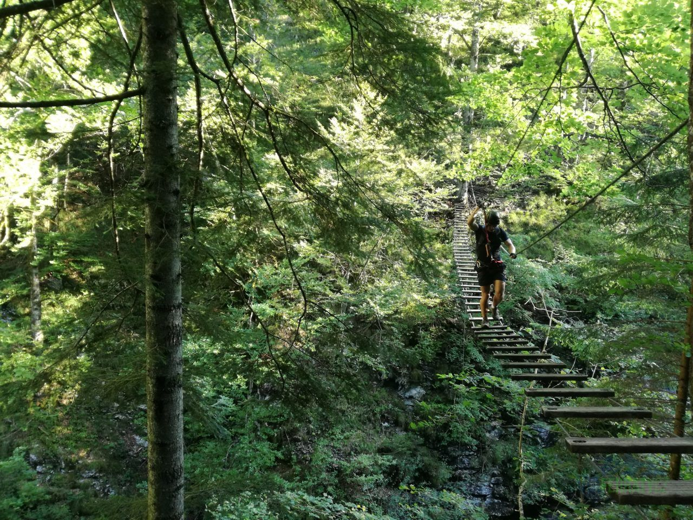
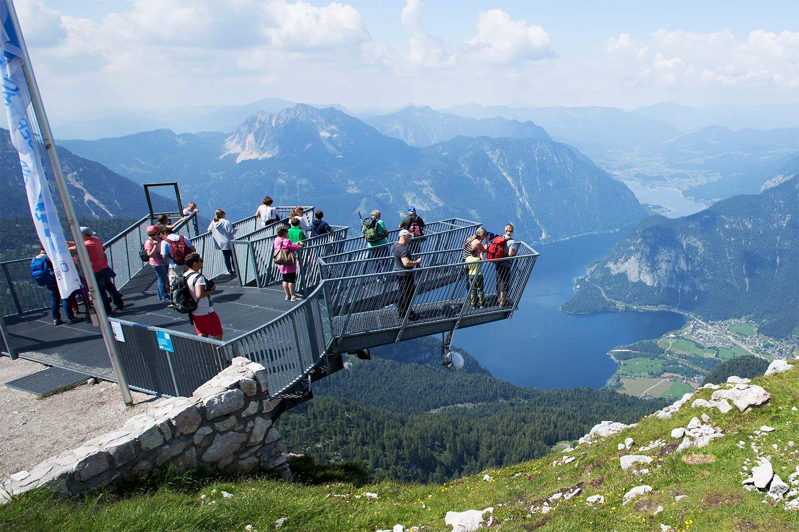
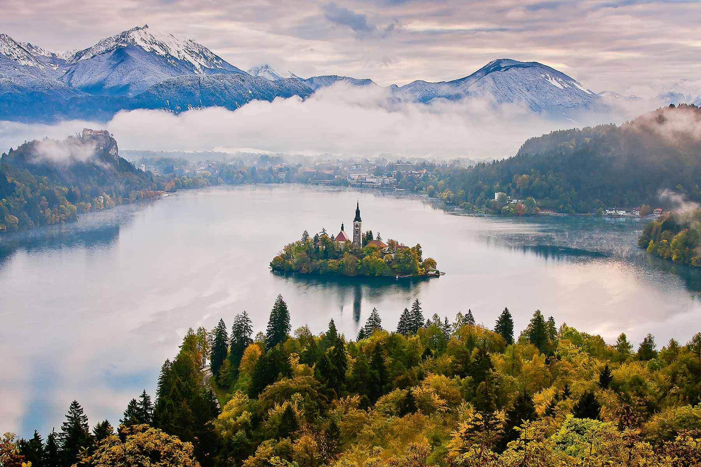
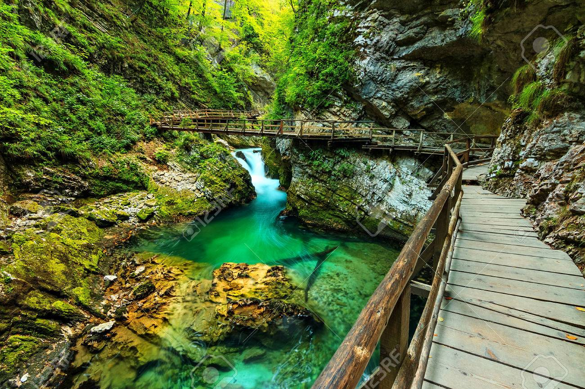
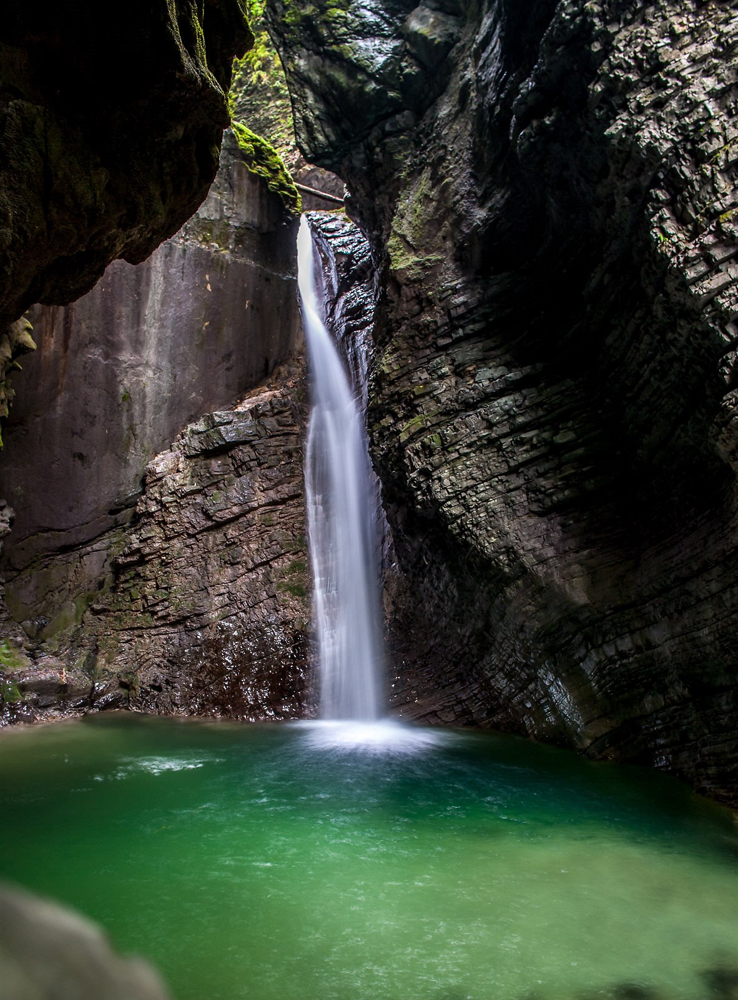
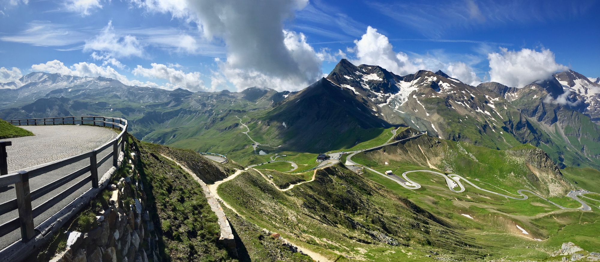
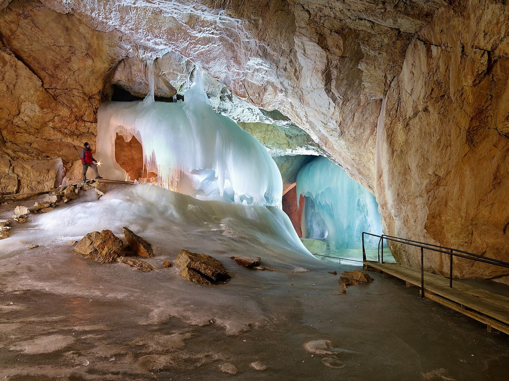

# Výlet do rakouských a slovinských Alp

## Trasa

[1. část](https://www.google.cz/maps/dir/Praha/Drachenwand,+Sankt+Lorenz,+Rakousko/Camping+Sch%C3%B6nblick,+5342+Abersee,+Rakousko/Postalm,+Rakousko/Hallstatt,+Rakousko/47.5484382,13.704776/Pyramidenkogel,+Rakousko/Bled,+Slovinsko/Vintgar+gorge,+Podhom,+Zgornje+Gorje,+Slovinsko/Most+na+So%C4%8Di,+Slovinsko/@46.5069986,13.8113707,10.04z/data=!4m57!4m56!1m5!1m1!1s0x470b939c0970798b:0x400af0f66164090!2m2!1d14.4378005!2d50.0755381!1m5!1m1!1s0x4776a4f2ff1b667d:0x93823e45d0dca691!2m2!1d13.353333!2d47.810833!1m5!1m1!1s0x4776b0f4f4fae61b:0x8b5995920914b0c4!2m2!1d13.4377723!2d47.7250971!1m5!1m1!1s0x4776b6f2b9d5c38f:0x33f0df4a9657ef27!2m2!1d13.43738!2d47.65702!1m5!1m1!1s0x4771366f6e414663:0x16c165596a26c1ad!2m2!1d13.6492617!2d47.5622342!1m0!1m5!1m1!1s0x477077758e7a8cf3:0x1d009758230a54f0!2m2!1d14.1452778!2d46.6080556!1m5!1m1!1s0x477a8e1dd7139961:0x400f81c823fec50!2m2!1d14.1145798!2d46.3683266!1m5!1m1!1s0x477a90ef63193aa1:0x22bdc5923816ddea!2m2!1d14.0856595!2d46.3935926!1m5!1m1!1s0x477af77e2537b899:0x8788fc363ccbbf55!2m2!1d13.7429945!2d46.1520769!3e0?hl=cs)

- Praha
- Via ferrata Drachenwand nad Mondsee (lze zařadit dle počasí a času/zájmu případně také cestou domů)
- Sedlo Postalm
- Via ferrata Postalmklamm
- Hallstatt
- Dachstein West - vyhlídka Five fingers
- Woerthersee - vyhlídka Pyramidenkogel (zajížďka, možno vynechat)
- **Přejezd do slovinska**
- Jezero Bled
- Soutěska Vintgar
- Městečko Most na Soči

[2. část](https://www.google.cz/maps/dir/5216+Most+na+So%C4%8Di,+Slovinsko/Tolmin+Gorges,+Zatolmin,+Tolmin,+Slovinsko/Kozjak,+Kobarid,+Slovinsko/Bovec,+Slovinsko/46.4251476,13.5656649/Heiligenblut,+Rakousko/@47.1066694,12.8716951,11z/data=!4m33!4m32!1m5!1m1!1s0x477af77e2537b899:0x8788fc363ccbbf55!2m2!1d13.7429945!2d46.1520769!1m5!1m1!1s0x477af6489098147b:0x8ba56120886cc99e!2m2!1d13.740151!2d46.1980439!1m5!1m1!1s0x477a5c641886c3a1:0xf50ba1b259a12ee2!2m2!1d13.6008518!2d46.2624234!1m5!1m1!1s0x477a683c5d0fdefb:0x5d345816713d53fd!2m2!1d13.5516829!2d46.3376387!1m0!1m5!1m1!1s0x47776acfa2ce7fd7:0x8d3186646f07359e!2m2!1d12.84309!2d47.03982!3e0?hl=cs)

- Soutěska Tolmin
- Město Tolmin
- Vodopád Kozjak
- Bovec - kemp, možno aktivity [Alpicenter](http://www.alpicenter.cz/index.php)
- Mangartský průsmyk
- Jezero Predil
- Heligenblut - Grossglocker Hochalpenstrasse - Fusch (vysokohorská silnice, krásná panoramata, až cca do 2500 m.n.m., lze vynechat a jet jinudy

[3. část](https://www.google.cz/maps/dir/47.22225,12.8276329/Liechtensteinklamm,+Rakousko/Eisriesenwelt,+Werfen,+Rakousko/Hallein,+Rakousko/Salzburg,+Rakousko/Praha/@48.6447417,12.660533,8z/data=!3m1!4b1!4m33!4m32!1m0!1m5!1m1!1s0x4777280dbd6b642d:0x1a07724e3eae0852!2m2!1d13.2!2d47.3!1m5!1m1!1s0x4776c49a0e3542a9:0x176931c76ebb4ebd!2m2!1d13.1902483!2d47.5029578!1m5!1m1!1s0x477694fba1823a09:0x9a744eee8b4f7e80!2m2!1d13.10037!2d47.68248!1m5!1m1!1s0x47769adda908d4b1:0xc1e183a1412af73d!2m2!1d13.05501!2d47.80949!1m5!1m1!1s0x470b939c0970798b:0x400af0f66164090!2m2!1d14.4378005!2d50.0755381!3e0?hl=cs)

- Soutěska Liechtensteinklamm
- Bischoshofen - kemp
- Ledová jeskyně Eisriesenwelt
- Hallein - solné doly
- Salzburg - kemp, prohlídka města
- cesta domů

## Hezká místa po cestě

### Drachenwand via ferrata

### Camping Schoenblick

### Postalm

### Postalmklamm

### Hallstatt

### Five fingers Dachstein west

### Pyramiden kogel Woerthersee

### Jezero Bled

### Soutěska Vintgar

### Soutěska Tolmin

### Vodopád Kozjak

### Mangartský průsmyk

### Jezero Predil

### Grossglockner Hochalpenstrasse

### Liechtensteinklamm

### Ledová jeskyně Eisriesenwelt

